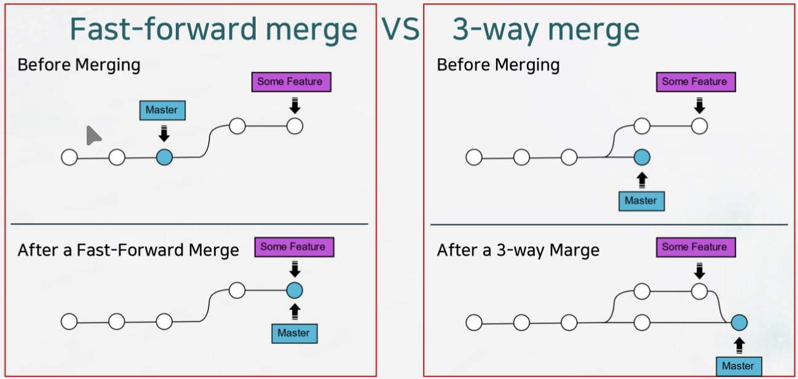
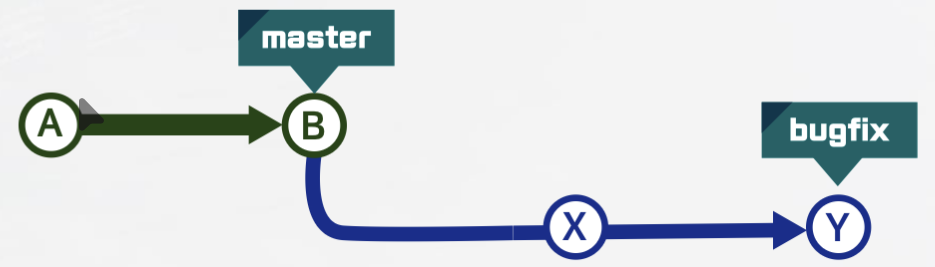
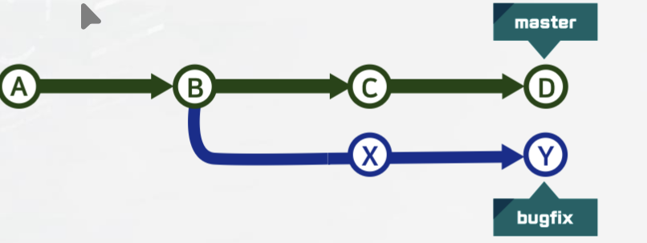
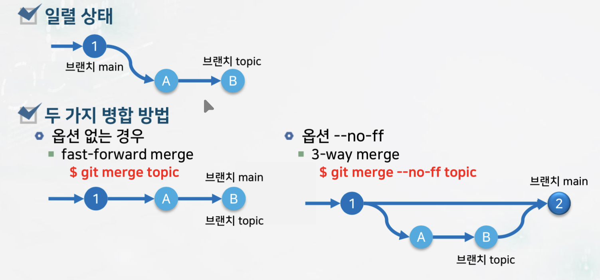

# 다양한 브랜치 병합

## 브랜치 병합

### 병합 (Merge)

- 두 개의 브랜치를 하나로 모으는 과정
  - fast-forward 병합
  - 3-way 병합



## Fast-forward 병합의 이해

### Fast-forward 병합 조건

- 현재 브랜치 master가 병합될 대상 커밋의 직접적인 뿌리가 되는 경우
  - 간단히 두 브랜치가 일렬 상태
  - bugfix 브랜치 이력이 master 브랜치 이력을 모두 포함하는 경우

**브랜치 master에서 병합 명령**

```bash
$ git merge bugfix    
```



**빨리 감기 fast-forward 병합 수행**

### Master 브랜치는 단순히 이동

- 이 때는 합칠 내용이 없음
  - 간단히 가리키는 지점이 대상 커밋이 되고 master가 bugfix로 이동 <br />
  -> 작업공간과 스테이징 영역이 이동되는 Y 상태로 됨

## 3-way 상태: 두 분기가 갈라진 상태

### 두 브랜치의 조상이 같은 경우

- master 브랜치 내의 변경 내용과 bugfix 브랜치 내의 변경 내용을 하나로 통합할 필요



### 3-way 병합
- 새로운 커밋을 사용하여 두 기록을 합침

## 3-way 병합 수행

### 새로운 커밋 E 생성

- 두 브랜치의 변경을 가져온 'merge commit(병합 커밋)' E를 생성
  - 병합 완료 후, 통합 브랜치인 'master' 브랜치로 통합된 이력이 생성
  - -m이 없으면 메세지 입력할 기본 편집기 실행 <br />
    >'Merge branch bbugfix'이 기본 메세지 내용

## 일렬 상태에서 기본 병합은 fast forward 병합

### 병합할 브랜치의 조상이 기준 브랜치인 경우, 즉 일렬 상태에서

- 병합 기본은 fastforward 병합이다



## 병합의 다양한 옵션

### non fast-forward 병합

```bash
$ git merge --no-ff {병합할 브랜치 명}
```

- 병합 실행 시에 'fast-forward' 병합이 가능한 경우에도 3-way 병합을 수형
- 병합된 브랜치가 그대로 남기 때문에
- 그 브랜치로 실행한 작업 확인 및 브랜치 관리 면에서 더 유용

### 병합의 다양한 옵션 종류

#### $ git merge {병합할 브랜치 명}

- 보통의 병합, 융통성 있는 병합
- 현 브랜치와 병합할 브랜치가 일렬 상태
  - fast-forward 병합
- 현 브랜치와 병합할 브랜치가 갈라져 있는 상태
  - 3-way 병합

#### # git merge --no-ff {병합할 브랜치 명}

- 무조건 3-way 병합되는 옵션

### 옵션 --squash

#### 강압적인(?) 병합

```bash
$ git merge --squash hotfix
```
- 사전적 의미(짓 뭉개다)에서 알 수 있듯이
  - 커밋 이력과 병합되는 브랜치 이력도 남기지 않음
  - 새로운 커밋에 상대 브랜치의 내용을 모두 합해 새로운 커밋으로 병합